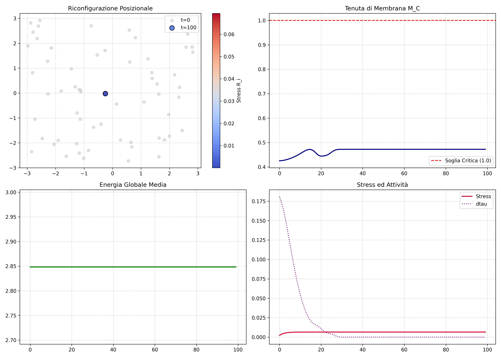

# PHI-INFINITY (Phi-Infinity) Computational Runtime

Unified Framework for Relational Systems, Semiotic Grounding, and Dynamic Governance.

**Author:** Massimiliano Brighindi  
**Edition:** Integral Blueprint 2026  



## Core Modules (`src/`)
* **`core.py`:** 6 primitive invariant equations, antisymmetric flows, and (1 - beta * R_i) force inversion.
* **`membrane.py`:** Emergent boundary persistence (M_C) evaluator.
* **`gating.py`:** Ex-ante deterministic gating (FirstDivergence) and REOPEN recovery.
* **`demo.py`:** Simulation pipeline generating multi-metric diagnostic plots.

## Execution
```bash
python main.py
python demo.py
```

## License
(c) 2026 Massimiliano Brighindi. All rights reserved.
